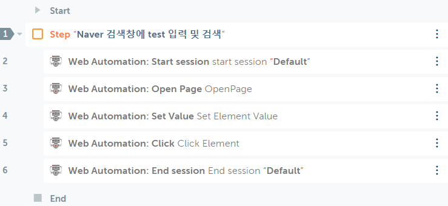
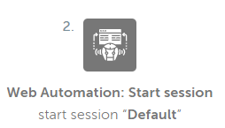
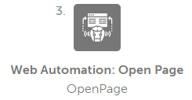
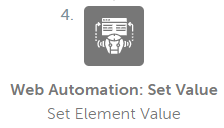
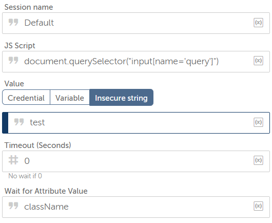
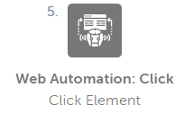
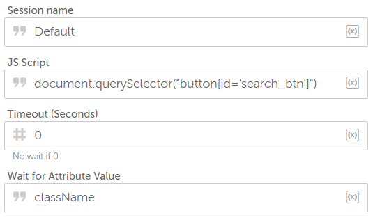

# Getting Started

## The Package configuration 


{width=40%,height=40%}

* 위의 action들 중 몇 가지를 이용하여 간단한 예제를 작성할 것이다. 


## Example_01 


### Description 
```
Naver 검색창에 검색어 입력 및 검색

```

* Session을 시작한다.  
* Naver 페이지를 연다.  
* 검색창에 "test"를 입력한다.  
* "검색"을 클릭한다.  
* Session을 종료한다. 


{width=40%,height=40%}


### Flow
```
* 가장 먼저 Session을 연결한다. 
```
{width=40%,height=40%}

```
* URL을 <https://naver.com>으로 설정한 뒤 해당 페이지를 연다.  
```
{width=40%,height=40%}

```
* 검색어 창에 "test"를 입력한다.   
```
{width=40%,height=40%}
```
** 아래는 검색어 입력창의 CSS Selector를 사용하여 element를 찾는 javascript 코드이다. 
```
{width=10%,height=10%}

```
* "검색"을 클릭한다. 
```
{width=40%,height=40%}

```
** 아래는 CSS selector로 element를 찾은 뒤 click event를 유발하는 javascript 코드이다.   
```
{width=10%,height=10%}


